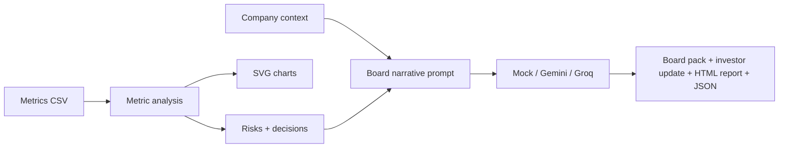

# Board Pack / Investor Update Agent

Turn startup metrics into a board pack, investor update, risk list, decision list, and charts.

<!-- FOUNDER_OS_STANDARD_README -->

## Output preview

The included demo output shows:

- `docs/demo_output/board_pack.md`: board-ready operating packet
- `docs/demo_output/investor_update.md`: investor update draft for founder review
- `docs/demo_output/analysis.json`: structured metric analysis
- `docs/demo_output/board_report.html`: HTML report

## 7-day Founder's Office sprint

- Day 1: Clean startup metrics and confirm definitions
- Day 2: Update company context and current operating constraints
- Day 3: Run the deterministic board pack workflow
- Day 4: Review risks, decisions, and narrative gaps with the founder
- Day 5: Tighten investor-safe language and remove unsupported claims
- Day 6: Align charts, asks, and board discussion points
- Day 7: Finalize the board or investor update packet

## Founder's Office signal

This repo demonstrates:

- metric interpretation for leadership communication
- separating analysis from narrative
- investor-safe writing discipline
- risk and decision framing
- board packet structure
- founder review before external sharing

## The founder problem

Founders often have the numbers but not the board narrative. The operating pain is converting MRR, churn, CAC, burn, runway, activation, and pipeline into a clear story about what changed and what decisions are needed.

## What this repo does

- analyzes startup metrics
- generates board pack and investor update drafts
- creates charts and HTML report
- keeps deterministic metric analysis separate from optional LLM narrative

## What a founder gets in 10 minutes

- board pack
- investor update draft
- risk list
- decision list
- metric charts
- HTML report
- JSON analysis

## Before and after

Before:

- monthly reporting assembled manually
- numbers without narrative
- unclear board asks
- metrics copied across tools

After:

- board-ready packet
- investor-safe update draft
- clear risks and decisions
- repeatable reporting workflow

## Who this is for

- early-stage founders
- Founder's Office teams
- board and investor reporting owners
- startup metrics operators
- BizOps operators

## Quick start

- Run `python -m pip install -e .`.
- Run `python -m board_pack_agent run --metrics examples/startup_metrics.csv --context examples/company_context.md --out docs/demo_output`.
- Optionally add `--risk-config configs/seed-stage-risk-rules.json` to customize the risk thresholds.
- Open `docs/demo_output/board_pack.md` first.
- Review `docs/demo_output/investor_update.md` before sending anything.

## How to fork and use this for your company

1. Click Fork.
2. Rename the repo if needed.
3. Replace `examples/startup_metrics.csv` with your company metrics.
4. Edit `examples/company_context.md` with your stage, strategy, and constraints.
5. Keep optional LLM keys in `.env`, never in committed files.
6. Move final outputs into Google Docs, Notion, Slides, or your board reporting folder.

### Non-technical path

- Replace one CSV: `examples/startup_metrics.csv`.
- Edit one context file: `examples/company_context.md`.
- Run one command.
- Read one output first: `docs/demo_output/board_pack.md`.

## Input format

- metrics CSV with month, MRR, churn, CAC, burn, runway, activation, pipeline, and notes where available
- company context file
- optional JSON risk rule config
- optional LLM provider settings in `.env`

The default sample data and examples are synthetic, anonymized, or template-only unless the repo explicitly documents a public source. Keep private customer, prospect, employee, investor, borrower, merchant, payment, or company data out of public forks.

## Output files

- `docs/demo_output/board_pack.md`: board-ready packet
- `docs/demo_output/investor_update.md`: investor update draft
- `docs/demo_output/analysis.json`: structured analysis
- `docs/demo_output/board_report.html`: HTML report
- `docs/demo_output/charts/`: metric charts

## Example founder workflow

- Week 1: update metrics and context.
- Week 2: run board pack draft.
- Week 3: review risks and decisions with leadership.
- Week 4: finalize investor update and board narrative.

## Customization guide

Customize these before using the repo for a real company:

- metric definitions
- risk thresholds
- board narrative sections
- chart selection
- optional provider prompts

## Standalone or integrated

Standalone:
Use this repo by itself if you only need to turn startup metrics and company context into board or investor narrative. Fork it, replace the sample input, run the workflow or copy the templates, and use the main output in your next founder review.

Integrated:
Use this repo with the Founder OS ecosystem if you want to connect it to adjacent operating workflows.

- Use after [founder-weekly-operating-review-agent](https://github.com/shubham1502-hue/founder-weekly-operating-review-agent) creates weekly signal.
- Pull GTM risk from [founder-os-revenue-engine](https://github.com/shubham1502-hue/founder-os-revenue-engine).
- Pull onboarding or activation risk from [founder-customer-onboarding-os](https://github.com/shubham1502-hue/founder-customer-onboarding-os).
- Pull retention risk, expansion readiness, churn drivers, and customer proof opportunities from [founder-retention-expansion-os](https://github.com/shubham1502-hue/founder-retention-expansion-os).
- Pull hiring plan, leadership gap, offer risk, and team-capacity signal from [founder-hiring-talent-pipeline-os](https://github.com/shubham1502-hue/founder-hiring-talent-pipeline-os).
- Use [startup-metrics-playbook](https://github.com/shubham1502-hue/startup-metrics-playbook) when metric definitions need tightening.

## Lifecycle handoff

Before:

- [founder-weekly-operating-review-agent](https://github.com/shubham1502-hue/founder-weekly-operating-review-agent) for weekly operating signal.
- [founder-os-revenue-engine](https://github.com/shubham1502-hue/founder-os-revenue-engine) for GTM risk.
- [founder-customer-onboarding-os](https://github.com/shubham1502-hue/founder-customer-onboarding-os) for activation risk.
- [founder-retention-expansion-os](https://github.com/shubham1502-hue/founder-retention-expansion-os) for retention, expansion, churn, and customer proof signal.
- [founder-hiring-talent-pipeline-os](https://github.com/shubham1502-hue/founder-hiring-talent-pipeline-os) for role priorities, hiring risks, leadership gaps, offer risks, and team-capacity signal.
- [startup-metrics-playbook](https://github.com/shubham1502-hue/startup-metrics-playbook) for metric definitions.

This repo produces:

- Board pack
- Investor update
- Risk list
- Decision list
- Narrative draft

After:

- Board meeting prep
- Investor update review
- Founder decisions and follow-up actions

## Onboarding and activation narrative

[Founder Customer Onboarding OS](https://github.com/shubham1502-hue/founder-customer-onboarding-os) can supply onboarding health, activation risk, high-value customer risk, and process bottlenecks that can be translated into board or investor narrative when retention, activation, or post-sale execution matters.

## Retention and expansion narrative

[Founder Retention Expansion OS](https://github.com/shubham1502-hue/founder-retention-expansion-os) can supply retention risk, expansion readiness, churn drivers, and customer proof opportunities that can be translated into board or investor narrative when customer health, NRR, GRR, churn, expansion, or referenceability matters.

## Product and roadmap narrative

[Founder Product Feedback Roadmap OS](https://github.com/shubham1502-hue/founder-product-feedback-roadmap-os) can supply product gaps, roadmap decisions, customer signal strength, revenue-blocking themes, retention-risk product gaps, and expansion unlocks for board or investor narrative.

## Hiring and org narrative

[Founder Hiring Talent Pipeline OS](https://github.com/shubham1502-hue/founder-hiring-talent-pipeline-os) can supply role priorities, hiring risks, leadership gaps, offer risks, and team-capacity signals that can be translated into board or investor narrative when org capacity matters.

## Where this fits in the Founder OS

Use this after `founder-weekly-operating-review-agent` creates weekly signal. Use `startup-metrics-playbook` to define metrics, `founder-os-revenue-engine` for GTM diagnosis, `founder-retention-expansion-os` when customer health, renewal, expansion, or proof should inform the board story, `founder-product-feedback-roadmap-os` when roadmap, retention, or product risk matters, and `founder-hiring-talent-pipeline-os` when hiring plan, leadership gaps, or org capacity matter.

## Why this matters

This is not an investor update template. It is a reporting workflow that connects metrics to board-level decisions.

## Roadmap

- Google Sheets import
- Slides export
- Notion export
- investor update email draft
- weekly review integration

## Contributing

See [CONTRIBUTING.md](CONTRIBUTING.md) if present. Practical improvements are welcome when they make the workflow easier to fork, run, or adapt.

## License

MIT License. See [LICENSE](LICENSE).

## Built by

Built by Shubham Singh, a founder-facing operator focused on RevOps, GTM systems, startup metrics, AI workflows, and operating systems for early-stage teams.

## Use this in your company

Fork it, replace the sample inputs with your company context, and run the workflow. Start with the main output listed in the Quick Start section. Keep private data out of public forks.

## If you are a Founder's Office candidate

Use this repo to understand how a founder-facing operator turns messy inputs into decisions, cadence, and execution artifacts. Fork it, adapt it to a real company example, and write a short case note explaining what changed.

---

## Detailed implementation notes

The founder-facing guide above is the fastest path. The original repo-specific notes are preserved below for deeper implementation context.

## Problem This Solves

Founders often have the metrics but not the board narrative. The problem is turning MRR, churn, CAC, burn, runway, activation, and pipeline into a clear view of what changed, what is risky, and what decisions need to be made.

## How It Helps

- Converts a startup metrics CSV into a board pack, investor update draft, risk list, decision list, charts, HTML report, and JSON analysis.
- Keeps deterministic metric analysis separate from optional LLM-generated narrative so the numbers stay inspectable.
- Gives founders a forkable monthly operating workflow before they have a finance, RevOps, or FP&A function.

## When To Fork This

- Fork this if you prepare board packs, investor updates, monthly business reviews, or founder/CEO metric reviews.
- Fork it when metrics exist in a spreadsheet but the narrative still takes hours to assemble.
- Replace the sample metrics, company context, risk rules, and output format with your own board cadence.

I built this because board prep is one of the clearest places where a Founder's Office operator can create leverage.

Most founders already have the numbers somewhere: MRR, churn, CAC, burn, runway, activation, pipeline. The hard part is turning those numbers into a clear operating narrative:

- What changed?
- What is actually risky?
- What decisions need to be made?
- What should investors hear?
- What should the founder stop ignoring?

This repo turns a startup metrics CSV into a board-ready pack, charts, risks, decisions, and an investor update draft.

## Use This In Your Company

This repo is designed to be forked into an internal company workflow. Fork it, replace the sample inputs with your company context, and keep only the parts that match your operating cadence. No permission request or sales call is needed before using it; the repo is the handoff. Check the license if you plan to redistribute your version.

- Use it as a monthly board-prep workflow before you hire finance, RevOps, or FP&A support.
- Keep the output set: board pack, investor update, risks, decisions, charts, HTML report, and JSON analysis.
- Replace the sample metrics CSV and company context with your own operating metrics.

## Minimum Edits To Make It Yours

Change these first:

| Edit | Where | Why |
|---|---|---|
| Replace the monthly KPI file. | `examples/startup_metrics.csv` | This drives the board pack, investor update, risks, decisions, and charts. |
| Rewrite the company context. | `examples/company_context.md` | Helps the narrative reflect your business model, stage, and board cadence. |
| Adjust risk thresholds. | `configs/seed-stage-risk-rules.json` or your own JSON file | Makes runway, churn, activation, pipeline, and growth warnings fit your company. |
| Review final investor wording. | generated `investor_update.md` | Keeps the output accurate before anything is shared externally. |

You can leave chart generation, HTML reporting, JSON output, and the mock provider alone on the first fork. Run the sample once, replace the two example inputs, then tune thresholds after one real board cycle.

## Risk Rule Config

Defaults work without any config file. To tune risk judgment for your stage, copy `configs/seed-stage-risk-rules.json`, change the thresholds, and pass it with `--risk-config`.

Tune these first:

- `low_runway_months`: when runway becomes a board-level risk.
- `healthy_runway_months`: when burn discipline should stay visible.
- `elevated_churn_rate`: when churn should appear in the risk list.
- `low_activation_rate`: when activation becomes a revenue leak risk.
- `low_pipeline_to_mrr`: when pipeline coverage is too thin.

## Why I Built This

I am building projects that show how I think as a Founder's Office candidate.

At STEMpedia, I worked close to the CEO and built RevOps infrastructure from scratch: reporting, CRM workflows, automations, handoffs, and weekly business visibility. That experience shaped how I look at metrics. A dashboard is not enough. A founder needs the narrative behind the dashboard.

This project is built from that lens.

If I joined an early-stage AI startup, this is the kind of system I would want running every month before the board meeting: not just a table of numbers, but a clear view of what changed, where the company is exposed, and what decisions need founder attention.

## What This Does

Input:

```text
metrics CSV with MRR, churn, CAC, burn, runway, activation, pipeline
```

Output:

- board-ready executive summary
- KPI snapshot
- what changed
- risks
- decisions needed
- likely board questions
- investor update draft
- charts for MRR, runway, activation, and pipeline
- JSON analysis for reuse in other workflows

The default demo runs without an API key. If a founder wants richer wording, they can plug in Gemini or Groq.

## Example Output

Demo files are committed in [docs/demo_output](docs/demo_output):

- [Board pack Markdown](docs/demo_output/board_pack.md)
- [Investor update draft](docs/demo_output/investor_update.md)
- [HTML board report](docs/demo_output/board_report.html)
- [Structured analysis JSON](docs/demo_output/analysis.json)

```text
Executive Summary

2026-06 was a stronger growth month, with MRR at $1.97M and month-over-month
growth of 10.4%. Activation improved to 54.0% and churn moved to 3.2%, but
runway is now 8.4 months, so the board discussion should stay focused on growth
quality, burn discipline, and which pipeline segments deserve founder time.

Decisions Needed

- Decide whether to reduce discretionary burn or start fundraising prep earlier.
- Decide whether activation improvement is the top product/GTM priority for the next month.
- Decide which pipeline segments deserve founder time before adding more top-of-funnel volume.
```

## How It Works



The system does three jobs:

1. It calculates the metrics that matter: growth, churn movement, CAC movement, burn movement, runway movement, activation movement, pipeline movement, burn multiple, pipeline coverage, and a simple health score.
2. It applies deterministic Founder's Office judgment: what is improving, what is risky, and what decisions should be forced into the board conversation.
3. It uses an LLM to turn that analysis into board and investor language.

## Why This Is Founder's Office-Coded

This is not a generic chart generator.

The value is in the operating judgment:

- Runway below 9 months should change the board conversation.
- Activation improvement matters only if it turns into durable revenue.
- Pipeline growth is not automatically good if quality is unclear.
- Burn increase needs to be justified by growth quality.
- The best board pack does not just report what happened. It frames what needs to be decided.

That is the work I want to do: help founders see the business clearly and make decisions faster.

## Stack

- Python
- Standard-library CSV analysis
- Standard-library SVG chart generation
- Gemini API or Groq API for optional narrative generation
- Mock provider for no-key demos
- Markdown, HTML, JSON, and SVG outputs

No pandas, no BI tool, no paid dependency required.

## Quickstart

Run the demo:

```bash
python -m pip install -e .

python -m board_pack_agent run \
 --metrics examples/startup_metrics.csv \
 --context examples/company_context.md \
 --risk-config configs/seed-stage-risk-rules.json \
 --provider mock \
 --out outputs/demo
```

Then open:

- `outputs/demo/board_report.html`
- `outputs/demo/board_pack.md`
- `outputs/demo/investor_update.md`
- `outputs/demo/analysis.json`

## Using Gemini

Gemini is the easiest free-tier-first option for this project.

```bash
python -m pip install -e '.[gemini]'
cp .env.example .env
# Add GEMINI_API_KEY to .env

python -m board_pack_agent run \
 --metrics examples/startup_metrics.csv \
 --context examples/company_context.md \
 --provider gemini \
 --out outputs/gemini-run
```

## Using Groq

Groq is useful as a fast fallback provider.

```bash
cp .env.example .env
# Add GROQ_API_KEY to .env

python -m board_pack_agent run \
 --metrics examples/startup_metrics.csv \
 --context examples/company_context.md \
 --provider groq \
 --out outputs/groq-run
```

## Input Format

Minimum CSV columns:

```csv
month,mrr,churn_rate,cac,burn,runway_months,activation_rate,pipeline
2026-06,1965000,3.2,15800,1120000,8.4,54,6100000
```

Recommended CSV:

```csv
month,mrr,churn_rate,cac,burn,runway_months,activation_rate,pipeline,notes
2026-06,1965000,3.2,15800,1120000,8.4,54,6100000,"Best month for expansion. Burn still rising but efficiency improved."
```

## What Founders Can Fork This For

- Monthly investor updates.
- Board meeting prep.
- Internal business reviews.
- Founder/CEO weekly metrics review.
- A lightweight metrics narrative before hiring finance or RevOps.
- A first operating system for an AI startup moving from seed to Series A.

The repo is intentionally simple so a founder can fork it, replace the sample CSV, add their own company context, and get a useful first version in minutes.

## Safety Choices

I made a few choices on purpose:

- The mock provider works without sending data to an external model.
- LLM providers are optional.
- Outputs are drafts, not final financial advice.
- The system separates deterministic metric analysis from generated narrative.
- The board narrative should always be reviewed by a founder before sending.

## Author Note

Built by Shubham Singh, focused on AI-native operating systems for early-stage founders.

I have built RevOps infrastructure from scratch at a founder-led startup, including CRM workflows, reporting, handoffs, automations, and weekly CEO visibility.

- LinkedIn: <https://linkedin.com/in/shubham9616>
- GitHub: <https://github.com/shubham1502-hue>
